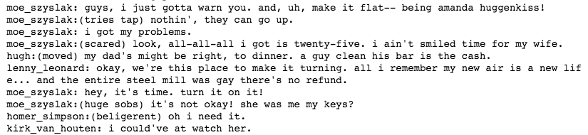

# Generate TV Scripts with LSTM

## Summary

In this project, we will generate our own Simpsons TV script using RNNs. The neural network we build will generate a new TV script for a scene at Moe's Tavern.

## Data

We will be using part of the [Simpsons dataset] (https://www.kaggle.com/wcukierski/the-simpsons-by-the-data) of scripts from 27 seasons. We will be using a subset of the original dataset. It consists of only the scenes in Moe's Tavern.

## Preprocessing Functions

```python
def create_lookup_tables(text):
    """
    Create lookup tables for vocabulary
    :param text: The text of tv scripts split into words
    :return: A tuple of dicts (vocab_to_int, int_to_vocab)
    """
    # Narrow text down to unique words
    vocab = sorted(set(text))
    vocab_to_int = {word: ii for ii, word in enumerate(vocab)}
    int_to_vocab = dict(enumerate(vocab))
    return (vocab_to_int, int_to_vocab)
```

Created two dictionaries to go from words to ids and from ids to words. Next created another dictionary to help with tokenizing punctuation.

## Choose Word

```python
def pick_word(probabilities, int_to_vocab):
    """
    Pick the next word in the generated text
    :param probabilities: Probabilites of the next word
    :param int_to_vocab: Dictionary of word ids as the keys and words as the values
    :return: String of the predicted word
    """
    # If I want to return only the highest probability word, I can use idx = np.argmax(probabilities)
    idx = np.random.choice(len(int_to_vocab), p=probabilities)
    word = int_to_vocab[idx]
    return word
```

## Results



We trained on less than a megabyte of text. For better results, we could use the broader Simpsons dataset.
